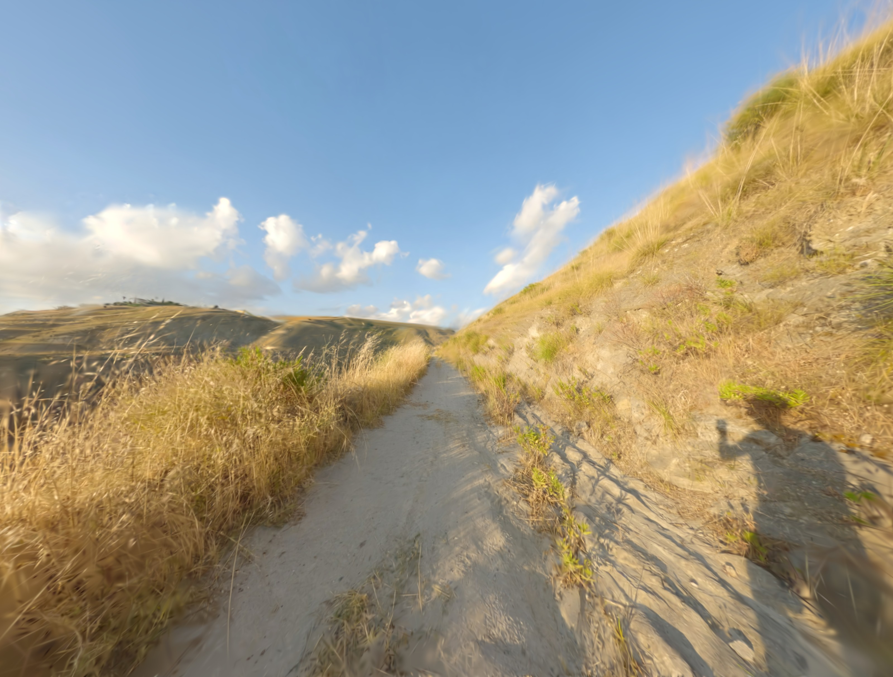
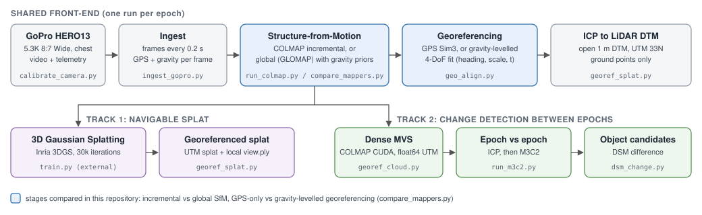
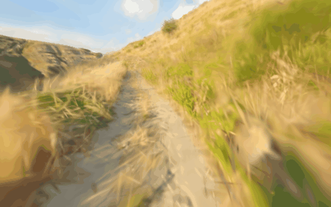
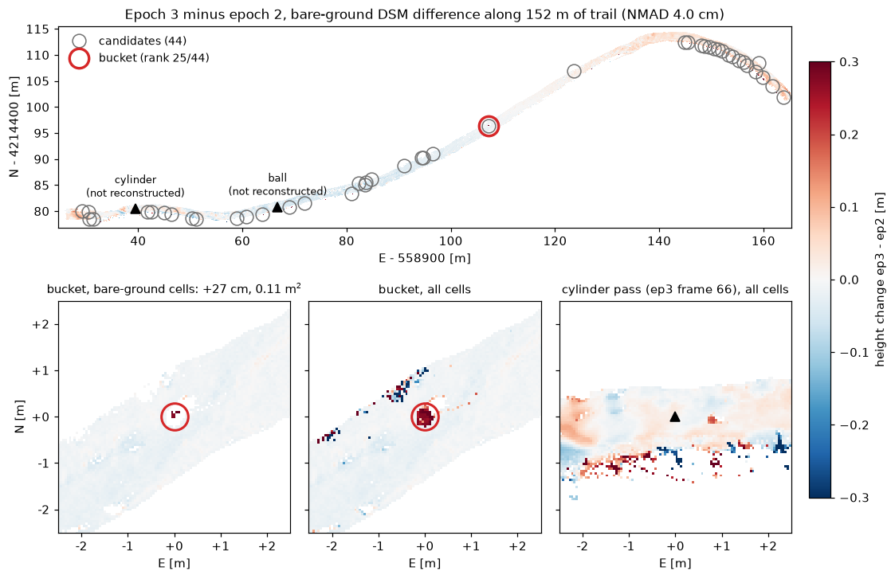

# Aspromonte: georeferenced trail reconstruction and change detection from a walking GoPro

Action-camera video of a mountain trail, turned into a georeferenced 3D Gaussian Splatting
model and into change maps between repeated passes, in UTM coordinates.

<p align="center">
  
  <br><em>Rendered from the 3DGS model at one of its training camera poses
  (30 m stretch of the second pass, 121 frames at 3200 px).</em>
</p>

A GoPro HERO13 was walked three times along the same 152 m trail in the Aspromonte massif
(Calabria, Italy). This repository goes from the raw video and its telemetry (GPS and
gravity) to

- **Track 1:** a navigable 3D Gaussian Splatting (3DGS) model, georeferenced by GPS and
  refined by ICP onto an open 1 m LiDAR terrain model;
- **Track 2:** dense point clouds of each pass in the same UTM frame, compared with M3C2
  and DSM differencing to find what changed.

It wraps [COLMAP](https://colmap.github.io) (incremental and global SfM, dense MVS) and the
[Inria 3DGS](https://github.com/graphdeco-inria/gaussian-splatting) code, and adds what
they do not cover: GoPro fisheye calibration, telemetry ingestion, robust GPS
georeferencing on near-linear tracks, gravity priors from the GoPro IMU, ICP onto the DTM,
and scripted change detection with QC gates.

<p align="center">
  
</p>

## Quick start

One epoch, end to end (frames, SfM, georeferencing, dense cloud and, with `splat true`,
the 3DGS model), driven by the shared reconstruction contract in `pipeline.conf`:

```bash
python3 run_pipeline.py --config pipeline.conf --video seg01.mp4 --workdir seg01
```

Each stage resumes from existing outputs; `--from`/`--to` restrict the range, `--dry-run`
prints the plan. QC gates stop the run on the failures that are otherwise silent (thin
registration, weak GPS fit, empty dense output, mislocated georeferencing).

Compare two epochs:

```bash
python3 run_m3c2.py --ref seg01_ep2/colmap/dense/fused_utm.ply \
    --cmp seg01_ep3/colmap/dense/fused_utm.ply --auto-icp \
    --track seg01_ep2/gps.csv --max-track-dist 10 --out m3c2_ep3_vs_ep2
# reuse the registration it prints (matrix and local shift):
python3 dsm_change.py --ref seg01_ep2/colmap/dense/fused_utm.ply \
    --cmp seg01_ep3/colmap/dense/fused_utm.ply \
    --icp m3c2_ep3_vs_ep2/icp_auto.txt --cc-shift -558997 -4214492 -123 \
    --track seg01_ep2/gps.csv --out dsm_ep3_vs_ep2
```

Compare incremental and global SfM, with and without gravity priors
(requires `pycolmap>=4.2`):

```bash
python3 compare_mappers.py --epoch ./seg01_ep2 --video Attempt_2.MP4 \
    --calibration ./calib_out/calibration_fisheye.json \
    --dtm aspromonte_dtm_utm33n.tif --out ./sfm_compare/seg01_ep2
```

Individual stages and their options: [docs/PIPELINE.md](docs/PIPELINE.md).

## Setup

```bash
python3 -m venv venv && venv/bin/pip install -r requirements.txt
```

- [COLMAP](https://colmap.github.io) with CUDA for dense MVS. On Blackwell GPUs build it for
  arch 89: [docs/BUILD_COLMAP_CUDA.md](docs/BUILD_COLMAP_CUDA.md).
- The [Inria 3DGS](https://github.com/graphdeco-inria/gaussian-splatting) code, cloned into
  `gaussian-splatting/`, for Track 1 only.
- ExifTool ≥ 13.0 for the GPS9 and GRAV telemetry streams.
- `pycolmap>=4.2` (CPU wheel) for `compare_mappers.py`.

Tested on WSL2 (Ubuntu), RTX 5070 Ti Laptop (12 GB), CUDA 12.8, Python 3.12. Capture
settings and environment notes: [docs/ENVIRONMENT.md](docs/ENVIRONMENT.md).

Tests run on synthetic scenes with known ground truth:

```bash
python3 tests/test_run_m3c2.py && python3 tests/test_dsm_change.py && python3 tests/test_gravity_georef.py
```

## Results

### Structure-from-Motion and georeferencing

Three passes of about 600 frames each, pycolmap 4.2.1 on CPU, one run per configuration:

| Mapper | Registered | Reprojection error | Time | Failures |
|--------|-----------|--------------------|------|----------|
| COLMAP incremental | all frames | 0.39–0.45 px | 436–655 s | none |
| COLMAP global (GLOMAP) | all frames | 0.38–0.45 px | 170–440 s | ep1 bent by up to 14° |
| global + GoPro gravity priors | all frames | 0.38–0.45 px | 188–253 s | none |

The bent ep1 model has a normal reprojection error; only the GPS residual (5.75 m) and
the disagreement with the GoPro gravity reveal it. A second random seed bends it at the
same place.

Rotation left between passes by the georeferencing (global model with gravity priors;
the incremental model gives the same values within 0.3°):

| Georeferencing | ep2 → ep1 | ep3 → ep2 | ep3 → ep1 | GPS residual (median) |
|----------------|-----------|-----------|-----------|-----------------------|
| GPS only, Sim3 (7 DoF) | 5.6° | 5.1° | 0.7° | 0.31–0.55 m |
| Gravity-levelled (4 DoF) | **0.6°** | **1.4°** | 1.1° | 0.95–1.33 m |

On a near-straight walk GPS does not constrain the roll about the direction of travel;
fixing the vertical with the GoPro gravity removes most of the tilt between passes, at
the cost of a larger GPS residual. Details: [docs/SFM_COMPARISON.md](docs/SFM_COMPARISON.md).

### 3D Gaussian Splatting

<p align="center">
  
  <br><em>3DGS model of the whole second pass, rendered along the walked path.</em>
</p>

### Change detection

On bare ground the DSM difference between two passes has a noise level (NMAD) of 1.3 cm
(ep2 vs ep1) and 4.0 cm (ep3 vs ep2, low light); M3C2 gives 3.9 and 6.3 cm. Of the objects
placed on the trail, the bucket is recovered 8 cm from its expected position
(+27 cm, 0.11 m²); the cylinder and the ball are not reconstructed by MVS at the working
resolution, and a 1.3 cm plasterboard sheet is below the detection floor.

<p align="center">
  
</p>

Automatic detection is **not yet discriminative**: with default parameters, ep3 vs ep2
yields 44 candidates with the bucket ranked 25th, and the object-free control (ep2 vs ep1)
yields 48. Details: [docs/CHANGE_DETECTION.md](docs/CHANGE_DETECTION.md).

## Limitations

- **One segment, three passes.** All numbers come from a single 152 m trail on an open
  slope. Forest canopy, longer sequences and other cameras are untested.
- **Residual tilt.** Even after gravity levelling, passes differ by up to 1.5°, and the ICP
  onto the 1 m DTM still tilts each model by 1.6–3.2°. A misalignment between the GoPro
  IMU and the optical axis, a bias of the ICP on grass, or both could explain it; they
  have not been separated yet.
- **Absolute accuracy.** Consumer GPS gives metre-level georeferencing; the ICP onto the
  DTM brings the ground to 0.3–0.4 m RMS.
- **Rigid alignment between epochs.** A single rigid transform does not absorb the drift
  along the sequence; most false positives come from the ends of the sequence and from a
  stretch with non-rigid drift.
- **Small objects.** Thin, dark or glossy objects are missed at `max_image_size` 1000.
- **Splat views off the walked path.** A forward walk constrains the 3DGS model only near
  the camera path: renders from the walked path are sharp, while viewpoints away from it
  show floaters and a smeared background.
- **Licensing of Track 1.** The Inria 3DGS code is non-commercial; see below.

## License

The code in this repository is released under the MIT License ([LICENSE](LICENSE)).
Third-party components keep their own terms: COLMAP and GLOMAP (BSD), the Inria 3DGS code
(non-commercial research license). The Inria license applies to Track 1 only; Track 2
(COLMAP SfM and dense MVS plus the scripts here) depends only on permissive licenses.
Permissively licensed splat renderers also exist (e.g. `gsplat`, Apache-2.0).

## Acknowledgements

Built on [COLMAP](https://colmap.github.io), [GLOMAP](https://github.com/colmap/glomap),
[3D Gaussian Splatting](https://github.com/graphdeco-inria/gaussian-splatting),
[py4dgeo](https://github.com/3dgeo-heidelberg/py4dgeo) and OpenCV. Elevation data: PST
LiDAR DTM (MASE, CC BY 4.0), Regione Calabria and TINITALY (INGV).
